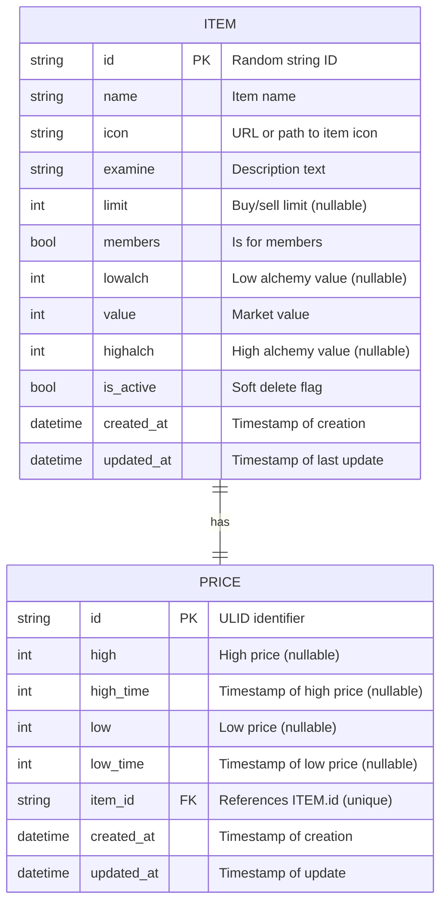

# Runescape Project

A full-stack web application built with FastAPI, React/Next.js, and PostgreSQL, containerized with Docker.

---

## Tech Stack

- **Backend:** Python, FastAPI, WebSockets
- **Frontend:** React, Next.js, Tailwind CSS
- **Database:** PostgreSQL
- **Containerization:** Docker & Docker Compose

---

## DB Diagram



---

## Features

- Real-time communication using WebSockets
- RESTful API with FastAPI
- UI using Next.js and Tailwind CSS
- Persistent data storage in PostgreSQL
- Fully containerized development and deployment environment

---

## Getting Started

### Prerequisites

- Docker and Docker Compose installed on your machine
- (Optional) Python 3.10+ if running backend locally

---

### Installation & Running

1. **Clone the repository**

   ```bash
   git clone git@github.com:prabhat-bhartola/Runescape.git
   cd Runescape
   ```

2. **Running the project**

   ```bash
   docker-compose build
   docker-compose up
   ```

3. Web started on `http://localhost:3000/`.

### How things are working internally?

- Whenever the project is run, we fetch items from `https://prices.runescape.wiki/api/v1/osrs/mapping` and insert them in db.
- There is a background task running every 30 seconds that fetches new prices for our items, identifies which prices are updated and updates them in db. There are some prices for items that may not exist in out items table, we discard those prices (Typically 1-2%).
- After the prices are updated, we send the data to frontend via websockets and frontend updates the affected prices.
- This can be verified by deleting all entries from the price table. They are automatically populated after 30 seconds.

### Some things that could have been better?

1. **Maintaining price history** - Whenever we get an updated price, we update it in db. Price history will allow users to look at past trends.
2. **Pagination** - Currently we're fetching 1000 entries. Pagination is implemented from backend but not from frontent.
3. **Search, Tests etc** - Time constraint.
